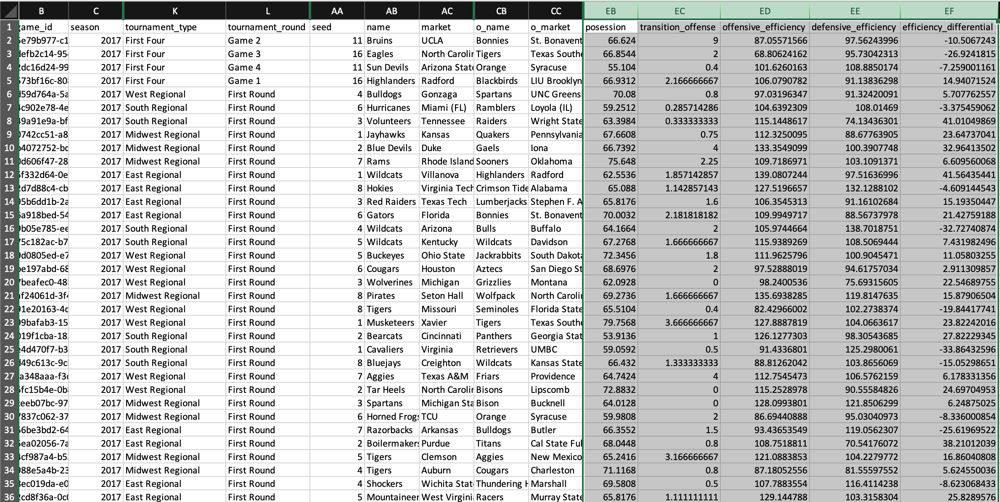

# A-Frame, Python, and NCAA Men's Basketball Data

## Demos
[Interactive 3D Chart](https://hopetambala.github.io/aframe-NCAAB/aFrame/)

<p align="middle">
    
</p>

## Description
The goal of this project was to use Google's BigQuery Python client library to query data in [Kaggle's NCAA Basketball data](https://www.kaggle.com/ncaa/ncaa-basketball) which dates from as far back as 1894. We chose a subset of data from the 2017-2018 NCAA Basketball Tournament bracket and created an A-Frame Visualization. 

The data was queried into a Pandas to allow for easier data manipulation. CSVs of the data were generated and placed into the Aframe folder. Using d3, that data was loaded into Aframe to create a 3D "Bracket-like" Scatter Plot that explores the relationships between the basketball teams
A) Seed in the Tournament
B) Playing Style
C) Progression into the tournament.

## Resources 
[NCAAB Data Set](https://www.kaggle.com/ncaa/ncaa-basketball)

[Basketball Analytics](https://www.nbastuffer.com/team-evaluation-metrics/)

## Libraries
[Pandas](https://pandas.pydata.org/)

[Google BigQuery](https://cloud.google.com/bigquery/docs/reference/libraries)

[A-Frame](https://aframe.io/)


## Project Layout
    ├── python                    # Folder for data generation script and data in csvs
    ├── javascript                # Folder for Aframe 
    ├── LICENSE              
    └── README.md

## Build and run

### Python 
Install virtual environment library
```
cd python/
pip install virtualenv #if you don't have virtualenv installed 
```

Create and activate virtualenv
```
virtualenv <Name_of_Virtual_Environment>
source <Name_of_Virtual_Environment>/bin/activate
```

Install project requirements usings the reqs.text
```
pip install -r reqs.txt
```

Install BigQuery helper function
```
pip install -e git+https://github.com/SohierDane/BigQuery_Helper#egg=bq_helper
```

Enable Google authentication by exporting the required .json keys via terminal
```
export GOOGLE_APPLICATION_CREDENTIALS=./secrets/Data\ Visualization-0a64d281dd18.json
```

Run python script to generate CSV via terminal
```
python bball_query.py
```

### Javascript 
Run the following in the javascript folder to start your own server
```
python -m SimpleHTTPServer
```
## Tutorial & Development
### BigQuery and Pandas
We used Kaggle's NCAA Basketball dataset as the basis for the A-Frame visualization. We generated some "secret" keys in order to get access to the Python BigQuery library and then used pandas to query the data using the below `SELECT` statement.

```
query = """
    SELECT 
        *
    FROM `bigquery-public-data.ncaa_basketball.mbb_games_sr` as teams_game
    WHERE teams_game.season = 2017
    AND teams_game.tournament = 'NCAA'
    AND teams_game.tournament_type IN ('South Regional', 'West Regional', 'National Championship','East Regional','First Four','Midwest Regional','Final Four');
"""
```

We then threw that into the results from that query into a Pandas Dataframe and created a CSV

```
df = ncaa_basketball.query_to_pandas_safe(query, max_gb_scanned=1)
```
```
df.to_csv(r'generated_data/'+'2017_season_detailed'+'.csv')
```
#### NBA Analytics and Equations
There was a decent amount of manual manipulation that was required to get the CSV in the correct format. 
<p align="middle">
    
</p>

The CSV generated had data on basketball matches versus teams. This made it harder to create a scatterplot regarding the stats of individual teams. We figured out that if we just copy and pasted the "Away" teams (and their stats) for each match and appended them to the end of the excel sheet, we would be able to make the scatterplot based on teams.

There were three variables we created to generate analytics for each team in a game.
- Possesion
- Offensive Efficiency
- Defensive Efficiency 

##### Possession
How the Possession is Calculated?
It counts as a team possession every time when a player of that team;
- attempts a field goal,
- misses a shot and does not get the offensive rebound,
- turns the ball over (some sources add “turnovers that are assigned to teams” for a more precise possession calculation),
- goes to the line for two or three shots and either makes the last shot or does not get the rebound of a missed last shot.

```
Basic Possession Formula=0.96*[(Field Goal Attempts)+(Turnovers)+0.44*(Free Throw Attempts)-(Offensive Rebounds)]
```

##### Offensive Effiency
The number of points a team scores per 100 possessions. This variable is determined using the previously the Possession variable
```
Offensive Efficiency Formula=100*(Points Scored)/(Possessions)
```

##### Defensive Effiency
The number of points a team allows per 100 opposing team possessions.
```
Defensive Efficiency Fomula=100*(Points Allowed/Possessions)
```
Note: In a game, the  “defensive efficiency” of a team equals to the “offensive efficiency” of the opponent team as well

### AFrame

#### d3 Data Manipulation


## Extras
### Created Metrics
[Win Chance Percentage](https://public.tableau.com/views/NCAAB-aFrame/WinPCTChange?:embed=y&:display_count=yes&publish=yes)

[Transition Offense](https://public.tableau.com/profile/hope.tambala#!/vizhome/NCAAB-aFrame/TransitionOffense)
